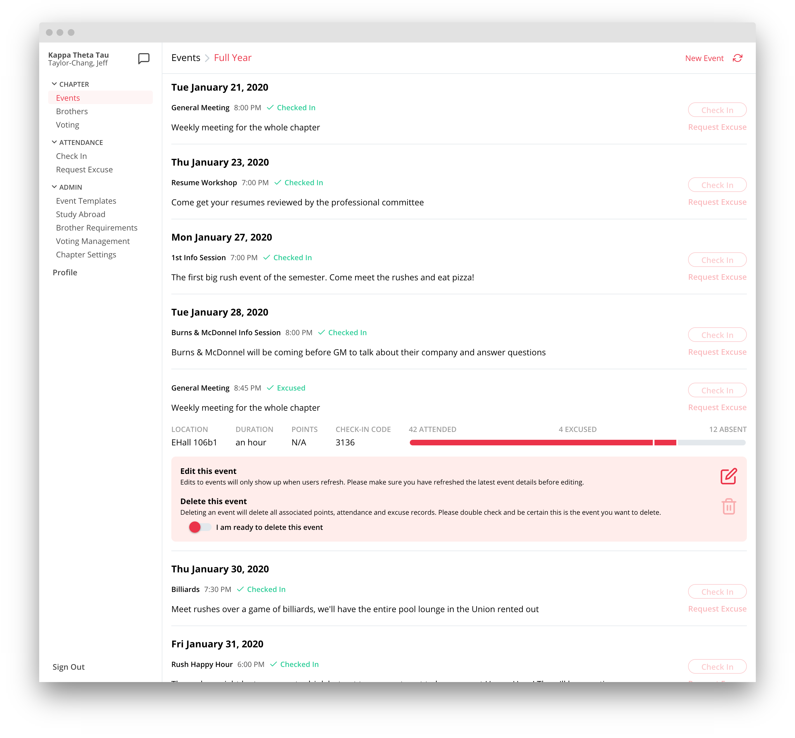

# kappa-desktop

[](https://app.netlify.com/sites/kappa-app/deploys)


## Secrets

Create a file `src/secrets.ts` as follows:

```javascript
export const API_URL = '<CHANGE ME>';

export const GOOGLE_CLIENT_IDS = {
  dev: '<CHANGE ME>',
  prod: '<CHANGE ME>'
};
```

## Development

| command      | description                                                  |
| ------------ | ------------------------------------------------------------ |
| `expo start` | run the development server. Add the `-c` flag to clear cache |

## Deploy

1. `npm install -g netlify-cli` if you don't have netlify installed
2. `yarn deploy`

## Preview


